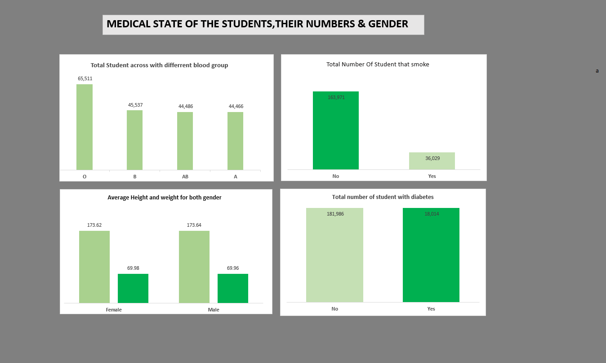
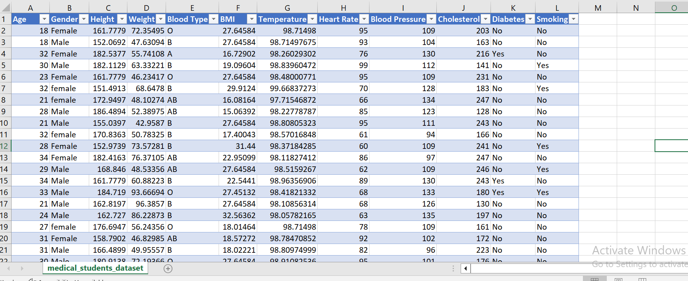
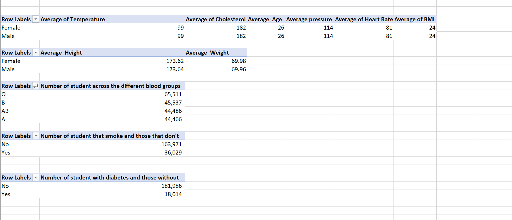
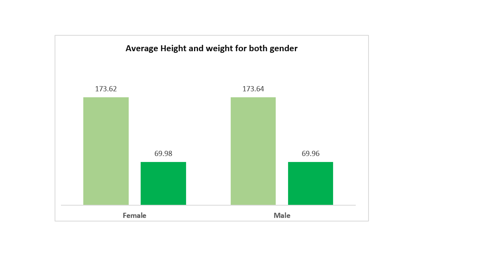
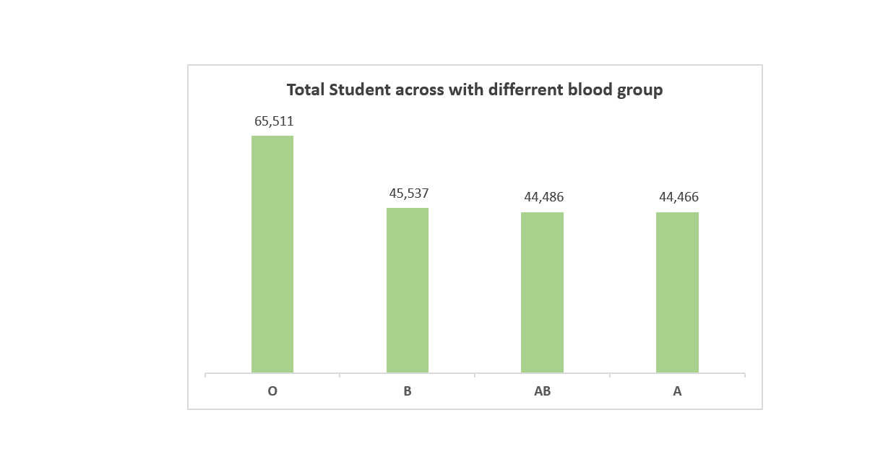
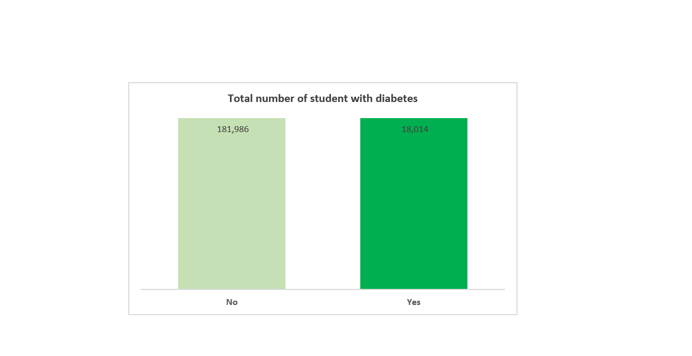

# Medical-Dataset

i participated on a project where i was asked to Analyzed the medical student data and asked to create different pivot tables displaying the following
  1. Average values for the following for male and female (Age,BMI,Temperature,Heart Rate,Blood pressure,and Cholesterol)
  2. Average Height and Weight for both Genders(in 2 decimal places)
  3. Number of students across the different blood groups
  4. Number of student who smoke and those that dont smoke
  5. Number of student who have diabetes and those that dont

## steps 
  I Cleaned the dataset,removed the empyt cells. its a dataset of 20,000 student (both male and female) 

  
  
Then i proceeded and  calculated the averages and total number of students in the catogories listed from the start, using a pivot table

 

from the above pivot table we can see the average temperature,age,average blood pressure, average heart rate and BMI,
then the total number of student under different categories.
So i created charts for the last four categories, better understanding.

------

2 
      on this chart,the green column represents the weight while the lemon column represents the height of the students.

---------------
3       
            this chart shows the number of student under the various blood groups

---------

4 

this shows YES for the number of student with diabetes and NO for the number of  those that dont have it.

i hope my analysis skill is quite understanding, i would appreciate your reveiws  as i continue to grow to improve on my skill.

  

